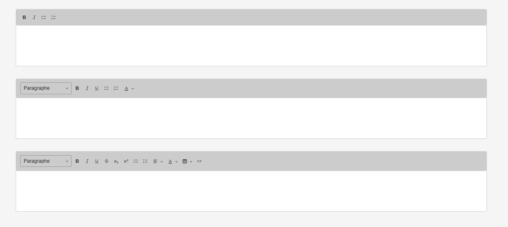

# Sulu Multi CKEditor Bundle

[](https://opensource.org/licenses/MIT)
[](https://php.net/)
[](https://sulu.io/)

Multiple CKEditor configurations for Sulu CMS - Provides different editor configurations within the same Sulu installation using YAML configuration without JavaScript rebuilds.

## Overview

The Sulu Multi CKEditor Bundle addresses Sulu's limitation of having a single global CKEditor configuration by providing YAML-based editor configurations. This allows you to define multiple editor configurations that are dynamically applied without rebuilding JavaScript assets.

## Features

- **🔧 YAML Configuration**: Define editor configs in YAML without rebuilding JS
- **🎨 Multiple Configurations**: Unlimited editor configurations per project
- **🏷️ Tag-Based Control**: Fine-grained HTML tag control (p, h1-h6, table, etc.)
- **⚡ No JS Rebuild**: Change configurations without recompiling assets
- **🔮 Future-Proof**: Designed for multiple editors (CKEditor, TipTap)
- **📝 Content Type Support**: Use `configurable_text_editor` in templates
- **🎯 Toolbar Customization**: Full toolbar configuration control
- **🔗 Sulu Integration**: Follows Sulu's configuration patterns
- **🔗 Link Support**: Internal and external link functionality
- **📝 Rich Features**: Headings, tables, lists, formatting, and more

## Requirements

- **PHP**: ^8.1
- **Sulu CMS**: ^2.5
- **Symfony**: ^6.4 || ^7.0
- **Node.js**: ^18 (for asset compilation)

## Installation

### Step 1: Install via Composer

```bash
composer require akawaka/sulu-multi-ckeditor-bundle
```

### Step 2: Register the Bundle

Add the bundle to your `config/bundles.php`:

```php
<?php

return [
    // ... other bundles
    Akawaka\SuluMultiCKEditorBundle\MultiEditorBundle::class => ['all' => true],
];
```

### Step 3: Configure Editors

Create `config/packages/akawaka_sulu_multi_text_editor.yaml`:

```yaml
akawaka_sulu_multi_text_editor:
    configs:
        # Default configuration
        default:
            editor: ckeditor
            tags:
                p: true
                a: true
                sulu_link: true
                ul: true
                ol: true
                h2: true
                h3: true
                h4: true
                table: true
                strong: true
                em: true
            toolbar:
                - 'heading'
                - '|'
                - 'bold'
                - 'italic'
                - 'externalLink'
                - 'internalLink'
                - '|'
                - 'bulletedlist'
                - 'numberedlist'
                - '|'
                - 'insertTable'

        # Minimal configuration
        minimal:
            editor: ckeditor
            tags:
                p: true
                a: true
                strong: true
                em: true
            toolbar:
                - 'bold'
                - 'italic'
                - 'externalLink'
                - 'internalLink'
                - 'numberedlist'

        # Rich configuration
        rich:
            editor: ckeditor
            tags:
                p: true
                a: true
                sulu_link: true
                ul: true
                ol: true
                h1: true
                h2: true
                h3: true
                h4: true
                h5: true
                h6: false
                table: true
                code: true
                blockquote: true
                strong: true
                em: true
                u: true
                s: true
                sub: true
                sup: true
                br: true
                hr: true
            toolbar:
                - 'heading'
                - '|'
                - 'fontSize'
                - 'fontColor'
                - '|'
                - 'bold'
                - 'italic'
                - 'underline'
                - 'strikethrough'
                - 'subscript'
                - 'superscript'
                - '|'
                - 'externalLink'
                - 'internalLink'
                - '|'
                - 'bulletedlist'
                - 'numberedlist'
                - '|'
                - 'insertTable'
                - 'blockQuote'
                - 'codeBlock'
                - 'horizontalLine'
```

### Step 4: Copy Frontend Assets

Copy the required JavaScript components to your project:

```bash
# Copy the JavaScript components from the bundle to your project
cp -r vendor/akawaka/sulu-multi-ckeditor-bundle/assets/admin/* assets/admin/

# Or manually copy these files:
# - assets/admin/adapters/CKEditor5Configurable.js
# - assets/admin/components/CKEditor5Configurable.js  
# - assets/admin/fields/ConfigurableTextEditor.js
```

### Step 5: Register Components in Your App

Add this code to your `assets/admin/app.js`:

```javascript
import {textEditorRegistry, fieldRegistry} from 'sulu-admin-bundle/containers';
import {initializer} from 'sulu-admin-bundle/services';

// Import the copied components
import CKEditor5ConfigurableAdapter from './adapters/CKEditor5Configurable';
import ConfigurableTextEditor from './fields/ConfigurableTextEditor';

// Config management (simple implementation)
let editorConfigs = {};

export const setEditorConfigs = (configs) => {
    editorConfigs = configs;
};

export const getEditorConfig = (configType = 'default') => {
    return editorConfigs[configType] || editorConfigs['default'] || {};
};

// Initialize the bundle when config is received from backend
initializer.addUpdateConfigHook('akawaka_sulu_multi_text_editor', (config, initialized) => {
    if (config && config.configs) {
        setEditorConfigs(config.configs);
    }
    
    if (initialized) {
        return;
    }
});

// Register the adapter and field type
textEditorRegistry.add('ckeditor5_configurable', CKEditor5ConfigurableAdapter);
fieldRegistry.add('configurable_text_editor', ConfigurableTextEditor);
```

### Step 6: Update Component Import

In the copied `assets/admin/components/CKEditor5Configurable.js`, update the import:

```javascript
// Change this line:
// NOTE: Import getEditorConfig from your main app.js file where you implement the config functions

// To this:
import {getEditorConfig} from '../app';
```

### Step 7: Build Assets

```bash
# Build your project assets
npm run build
# or
yarn build

# Don't forget to run Sulu's build command
php bin/console sulu:build --env=prod
```

### Step 8: Clear Cache

```bash
php bin/console cache:clear
```

## Development Environment (Bundle Testing)

The `tests/Application` directory is only for **bundle development and testing**. End users should follow the installation steps above.

### For Bundle Development

```bash
# Complete development installation
make install

# Start services  
make start

# Access application
# Website: http://localhost:8080
# Admin: http://localhost:8080/admin (admin/admin)
```

## Usage

### In Templates

Use the `configurable_text_editor` type in your Sulu templates:

```xml
<!-- Minimal editor: bold, italic, links, lists -->
<property name="intro" type="configurable_text_editor">
    <meta>
        <title lang="en">Introduction</title>
    </meta>
    <params>
        <param name="config" value="minimal"/>
    </params>
</property>

<!-- Default editor: standard features -->
<property name="content" type="configurable_text_editor">
    <meta>
        <title lang="en">Content</title>
    </meta>
    <params>
        <param name="config" value="default"/>
    </params>
</property>

<!-- Rich editor: all features -->
<property name="description" type="configurable_text_editor">
    <meta>
        <title lang="en">Description</title>
    </meta>
    <params>
        <param name="config" value="rich"/>
    </params>
</property>

<!-- With stripped paragraph tags -->
<property name="summary" type="configurable_text_editor">
    <meta>
        <title lang="en">Summary</title>
    </meta>
    <params>
        <param name="config" value="minimal"/>
        <param name="strip_p_tags" value="true"/>
    </params>
</property>
```

### Example Rendering



## Configuration System

### Available Tags

Control which HTML tags are allowed in each configuration:

| Tag | Description | Default |
|-----|-------------|---------|
| `p` | Paragraph tags | ✅ |
| `a` | Links | ✅ |
| `sulu_link` | Sulu internal links | ✅ |
| `ul`, `ol` | Lists | ✅ |
| `h1` | Heading 1 | ❌ |
| `h2`-`h6` | Headings 2-6 | ✅ |
| `table` | Tables | ✅ |
| `code` | Code blocks | ✅ |
| `blockquote` | Block quotes | ✅ |
| `strong`, `em` | Bold, italic | ✅ |
| `u`, `s` | Underline, strikethrough | ❌ |
| `sub`, `sup` | Subscript, superscript | ❌ |
| `br` | Line breaks | ✅ |
| `hr` | Horizontal rules | ❌ |

### Available Toolbar Items

Common CKEditor 5 toolbar items:

- **Text Formatting**: `heading`, `fontSize`, `fontColor`, `fontBackgroundColor`
- **Basic Styles**: `bold`, `italic`, `underline`, `strikethrough`
- **Advanced Styles**: `subscript`, `superscript`, `code`
- **Links**: `externalLink`, `internalLink` (Sulu-specific)
- **Lists**: `bulletedlist`, `numberedlist` (note: lowercase)
- **Alignment**: `outdent`, `indent`, `alignment`
- **Content**: `insertTable`, `blockQuote`, `codeBlock`
- **Utilities**: `horizontalLine`, `undo`, `redo`

**Important**: Use `externalLink` and `internalLink` for Sulu integration, not the generic `link`.

## Docker Development

### Quick Start

```bash
# Complete installation
make install

# Start services
make start

# Access application
# Website: http://localhost:8080
# Admin: http://localhost:8080/admin (admin/admin)
```

### Development Commands

```bash
# Environment
make start          # Start Docker services
make stop           # Stop services
make restart        # Restart services
make shell          # Access PHP container

# Development
make build          # Build frontend assets
make watch          # Watch assets for changes
make logs           # Show container logs

# Database
make db-reset       # Reset database
make admin          # Create admin user

# Quality Assurance
make validate       # Validate composer.json
make phpstan        # Run static analysis
make cs-fix         # Fix code style
make ci             # Run all QA tasks
```

## Architecture

### Configuration Flow

1. **YAML Config** → Parsed by `Configuration.php`
2. **Bundle Extension** → Processes and stores config
3. **Admin Class** → Exposes config to JavaScript via `getConfig()`
4. **JS Initializer** → Receives config via `addUpdateConfigHook`
5. **Editor Component** → Uses config to configure CKEditor5

### Key Files

```
src/
├── Admin/
│   └── MultiEditorAdmin.php              # Config exposure to JS
├── Content/Type/
│   └── MultiTextEditorType.php           # Content type implementation
├── DependencyInjection/
│   ├── Configuration.php                 # YAML schema
│   └── MultiEditorExtension.php          # Config processing
├── Resources/
│   ├── config/services.yaml              # Service definitions
│   ├── js/index.js                       # JS config management
│   └── views/content-types/
│       └── multi-text-editor.html.twig   # Twig template
└── MultiEditorBundle.php                 # Bundle class

assets/admin/                              # For end users to copy
├── adapters/CKEditor5Configurable.js     # Template parameter extraction
├── components/CKEditor5Configurable.js   # CKEditor5 component
├── fields/ConfigurableTextEditor.js      # Field type registration
└── app.example.js                        # Integration example

tests/Application/                         # For bundle development only
└── assets/admin/                         # Development/testing assets
```

## Extending

### Adding Custom Configurations

Create new configurations in your YAML:

```yaml
akawaka_sulu_multi_text_editor:
    configs:
        blog_post:
            editor: ckeditor
            tags:
                p: true
                h2: true
                h3: true
                strong: true
                em: true
                blockquote: true
                code: true
            toolbar:
                - 'heading'
                - '|'
                - 'bold'
                - 'italic'
                - '|'
                - 'blockQuote'
                - 'code'
```

Use in templates:

```xml
<property name="content" type="configurable_text_editor">
    <params>
        <param name="config" value="blog_post"/>
    </params>
</property>
```

### Future Editor Support

The system is designed for multiple editors:

```yaml
akawaka_sulu_multi_text_editor:
    configs:
        tiptap_config:
            editor: tiptap  # Future support
            tags:
                # Same tag structure
```

## Testing

Run the test script to verify installation:

```bash
./test_multi_editor.sh
```

This verifies:
- ✅ Docker environment setup
- ✅ Bundle registration
- ✅ Content type availability
- ✅ Asset compilation
- ✅ Configuration system

## Troubleshooting

### Configuration Not Applied

```bash
# Clear cache and rebuild
make restart
docker-compose exec php php tests/Application/bin/console cache:clear
docker-compose exec php php -d memory_limit=-1 tests/Application/bin/console sulu:build dev
```

### Memory Issues

All PHP commands must use unlimited memory:

```bash
# ✅ Correct
docker-compose exec php php -d memory_limit=-1 tests/Application/bin/console <command>

# ❌ Wrong - will cause memory exhaustion
docker-compose exec php php tests/Application/bin/console <command>
```

### CKEditor5 Issues

**Heading selection not working**: 
- Verify `heading` is in toolbar configuration
- Check that heading tags (h1-h6) are enabled in `tags`

**Links not working**:
- Use `externalLink` and `internalLink` instead of `link`
- Ensure `a` and/or `sulu_link` tags are enabled

**Lists not working**:
- Use `bulletedlist` and `numberedlist` (lowercase) in toolbar
- Enable `ul` and `ol` tags in configuration

### JavaScript Errors

1. Check browser console for errors
2. Verify config name matches YAML configuration
3. Rebuild assets: `make build`
4. Clear cache: `make restart`

## Documentation

- **[Configuration Guide](docs/CONFIGURATION.md)** - Detailed configuration documentation
- **[Template Examples](docs/template-example.xml)** - Example template usage
- **[Configuration Examples](docs/configuration-example.yaml)** - YAML configuration examples
- **[AI Development Guide](docs/HOW_TO_USE_AI.md)** - AI-assisted development guidelines

## License

This project is licensed under the MIT License - see the [LICENSE](LICENSE) file for details.

## Contributing

Contributions, issues and feature requests are welcome!

Feel free to check the [issues page](https://github.com/akawaka/sulu-multi-ckeditor-bundle/issues).
